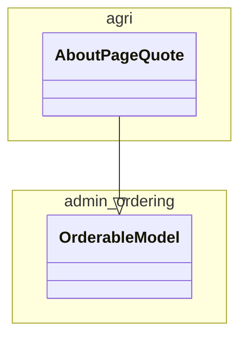

# agri

## Objectif

Ce module porte le parcours utilisateur proposé aux exploitantes et exploitants agricoles pour trouver des dispositifs d’aides correspondant à leur situation et à leurs besoins.

## Dépendances externes

* La bibliothèque [django-admin-ordering](https://pypi.org/project/django-admin-ordering/) est utilisée pour gérer l’ordre des citations sur la page "À propos".

## Dépendances internes

* [aides](../aides/README.md) : de la même manière que les exploitations agricoles dépendent des dispositifs d’aides, ce module dépend du module `aides`, qui fournit les dispositifs d’aides bien sûr, mais également toutes les informations de catégorisation permettant de mettre en relation la situation et les besoins d’une exploitation agricole avec les dispositifs à proposer.

## Modèle de données

