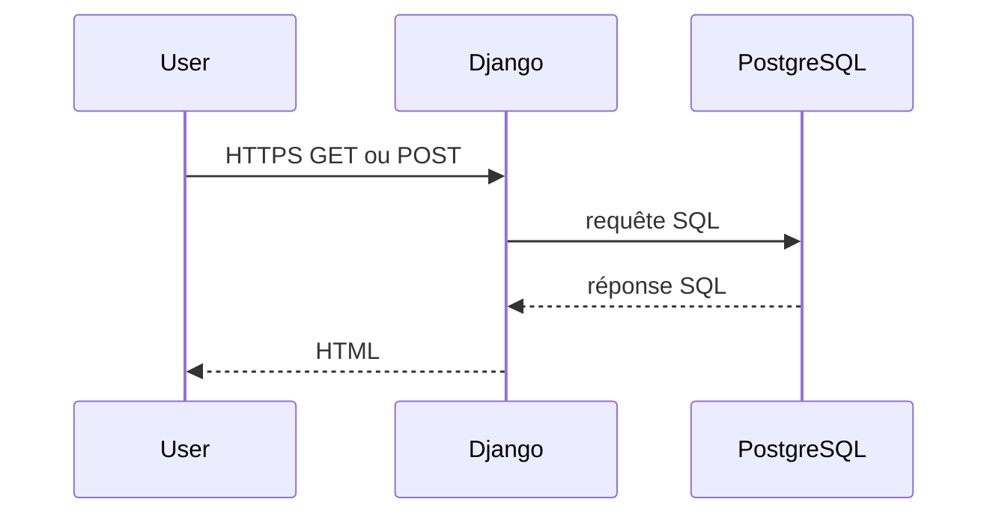
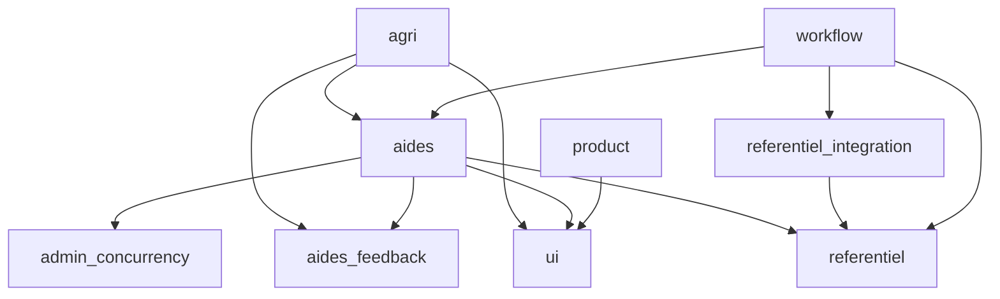
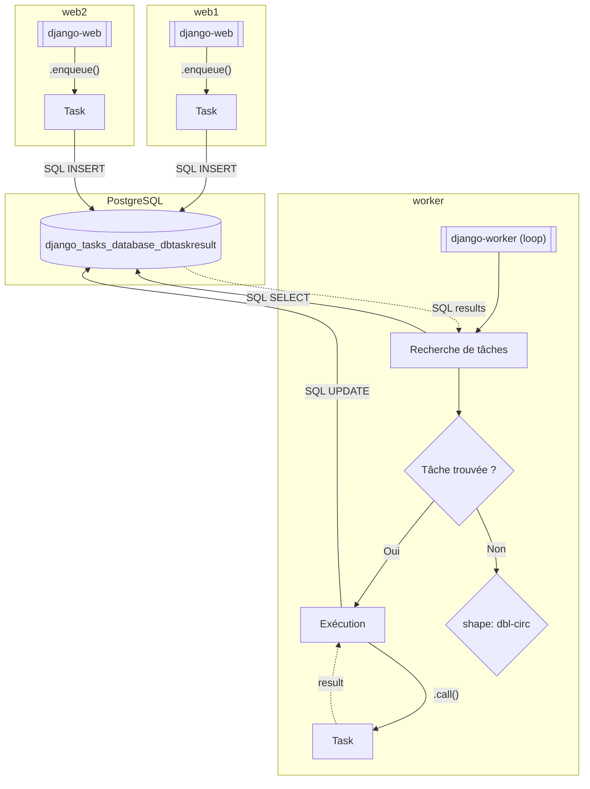

# Aides Agri – Architecture logicielle

## Introduction

La pile applicative Aides Agri est basée sur le framework web [Django](https://www.djangoproject.com/), codé en Python, et le serveur de base de données relationnelle PostgreSQL.

Il s’agit d’un **monolithe modulaire** :
* Monolithe parce qu’il n’y a qu’une seule base de données et une seule base de code ;
* Modulaire parce que la base de code autorise, via le framework Django, à isoler des briques de logique dans des packages Python.

## Architecture Django

### Le projet

Le projet Django est situé dans le répertoire `conf`. Il comprend, en plus des classiques points d’entrées WSGI/ASGI et définition des URLs :
* Les réglages :
  * Les réglages Django de base sont dans `settings/base.py` ;
  * Les réglages Django des apps installées (réutilisables ou spécifiques) sont dans `settings/apps/*` ;
  * Un assemblage par défaut des settings est disponible dans `settings/default.py` ;
  * Puis un assemblage spécifique à chaque contexte d’exécution est disponible :
    * `settings/devel.py` pour le développement local ;
    * `settings/testing.py` pour l’exécution des tests, que ce soit en local ou dans la CI ;
    * `settings/scalingo.py` pour l’exécution déployée chez Scalingo, quel que soit l’environnement ;
    * Le choix de l’assemblage se fait via la variable d’environnement `DJANGO_SETTINGS_MODULE` ;
* Une spécialisation de l’admin Django pour forcer la double-authentification.

### Les apps spécifiques

Les apps spécifiques sont rangées dans le répertoire `/apps/`. C’est rendu possible par l’ajout de ce répertoire au `PYTHONPATH` dans `conf/settings/base.py`.

#### Les apps utilitaires

* `ui` : pour des extensions à `django-dsfr` et la définition de templates de base, de styles de base, de composants réutilisables, etc. ;
* `admin_concurrency` : implémente un système de verrous sur l’édition de contenus dans l’admin Django.

#### Les apps métier

* `aides` : implémente les entités et les logiques métier liées aux dispositifs d’aide publics à l’agriculture ;
  * [Documentation spécifique](../../apps/aides/README.md) ;
* `agri` : implémente le parcours utilisateur destiné aux exploitantes et exploitants agricoles afin de les aiguiller vers les aides pertinentes pour leur situation et leur besoin ;
  * [Documentation spécifique](../../apps/agri/README.md) ;
* `aides_feedback` : implémente de quoi permettre à nos utilisatrices et utilisateurs de donner leur avis sur le parcours qui leur est proposé ainsi que sur les contenus qui leur sont présentés ;
* `pac` : implémente une représentation en base de données relationnelle du Plan Stratégique National de la PAC 2023-2027 ; c’est un outil à usage interne technique uniquement ;
* `product` : implémente les aspects périphériques du site web, comme les pages légales ; cette app Django pourrait être amenée à être extraite de cette base de code pour la rendre réutilisable au sein d’un modèle de base de code Django pour beta.gouv.fr ;
* `referentiel` : implémente un référentiel des démarches agricoles et de leurs données officielles, avec système d’export vers [data.gouv.fr](https://www.data.gouv.fr/datasets) selon [le schéma interministériel des aides publiques](https://schema.data.gouv.fr/etalab/schema-dispositif-aide/) ;
  * [Documentation spécifique](../../apps/referentiel/README.md) ;
* `referentiel_integration` : implémente des points d’entrée divers et variés pour intégrer des données venant de toutes sortes de sources vers le référentiel des démarches agricoles ;
  * [Documentation spécifique](../../apps/referentiel_integration/README.md) ;
* `workflow` : implémente une interface d’administration de l’intégration et de l’enrichissement des données de leur intégration via `referentiel_integration` à leur publication par `aides` sur le site Aides Agri.

### Diagramme des dépendances entre les apps Django spécifiques

> [!NOTE]
> Ce diagramme ne devrait jamais montrer de dépendance cyclique

## Architecture de la gestion des tâches d’arrière-plan

Afin de gérer l’exécution de tâches déclenchées via l’interface web, mais dont la durée est inconnue à l’avance (pour cause d’appel réseau externe par exemple), un processus dédié à l’exécution asynchrone est mis en œuvre :
* Basé sur le plugin [django-tasks](https://pypi.org/project/django-tasks/), et plus précisément son extension utilisant une base de données comme backend de stockage des messages, [django-tasks-db](https://pypi.org/project/django-tasks-db/) ;
* Cette brique logicielle intégrée dans la base de code Django se comporte comme un système Pub/Sub qui gérerait les deux côtés de la communication (publication de messages et consommation des messages, les messages étant stockés dans la base de données relationnelle) ;
* La distinction entre publication et consommation se faisant via le déploiement et l’infrastructure (cf [le diagramme d’infrastructure haut niveau](infrastructure-deploiement.md)) :
  * Les tâches étant déclenchées depuis l’interface web, ce sont les instances `web` de Django qui publient les messages ;
  * Une instance Django dédiée (séparée des instances `web` pour que les tâches de longue durée n’impactent pas les performances web), nommée `worker`, et unique pour éviter de manière facile les problèmes de consommation concurrente des messages ;
  * Évidemment, si une tâche de longue durée a elle-même besoin de déléguer l’exécution d’une tâche en arrière-plan, elle peut solliciter le worker selon le même principe.

## Architecture de l’interface web publique (le "front-end")

### CSS

* L’application contient très peu de CSS, l’essentiel du style étant assuré par le DSFR ;
* Les quelques fichiers CSS spécifiques sont rangés dans le répertoire `static/` de l’app Django concernée ;
* Aucun mécanisme de pre-processing ou post-processing n’est appliqué.

### Javascript

* Quand il y a besoin d’interactivité dans le navigateur, un contrôleur [Stimulus](https://stimulus.hotwired.dev/) est créé dans le répertoire `static/` de l’app Django concernée ;
* Les contrôleurs Stimulus étant des modules ESM, ils sont importés dans les pages directement en utilisant un [_importmap_](https://developer.mozilla.org/en-US/docs/Web/HTML/Element/script/type/importmap) présent dans le template de base, qui contient donc tous les modules réutilisables, et qui peut être surchargé page par page (chaque page ayant alors la responsabilité de réécrire un _importmap_ contenant tous les modules réutilisables en plus de ses modules spécifiques).

### Composants

Parfois le besoin se fait ressentir d’un composant web (des morceaux de HTML/CSS/JS fonctionnant ensemble et réutilisable à plusieurs endroits de l’application). Dans ce cas, les éléments sont rangés de la manière suivante :
* Les templates dans `app_django/templates/app_django/components` ;
* Les CSS et JS dans `app_django/static/app_django/components`.

L’app Django `ui` contient une page de présentation des composants web réutilisables, qu’il est conseillé d’utiliser pour présenter le composant dans ses différentes variantes et ainsi le documenter.

### Le service des fichiers JS/CSS/images

La fonctionnalité de gestion des fichiers statiques de Django est exploitée :
* Les fichiers statiques étant rangés dans le répertoire `static/` de chaque app Django (native, tierce-partie ou spécifique), la commande Django `collectstatic` permet de tous les regrouper dans un répertoire dédié (`/staticfiles/`) ;
* Le paquet externe [whitenoise](https://pypi.org/project/whitenoise) est utilisé pour :
  * Au moment du `collectstatic`, compresser les fichiers et leur assigner un nom unique permettant le cache-busting systématique ;
  * Via un middleware inclus très tôt dans la pile des middlewares Django, servir les fichiers statiques directement sans passer par un stockage dédié ni nécessiter de configuration sur le reverse proxy de l’hébergeur.

### Les dépendances logicielles "front-end"

Les dépendances sont listées dans le fichier [package.json](../../package.json).

Elles sont **recopiées** dans la base de code (dans le répertoire `/static/vendor`) via [un workflow GitHub](../../.github/workflows/vendor-js-deps.yml) qui :
* Lit le fichier [vendor.txt](../../vendor.txt) pour recopier tels quels les fichiers qui sont fournis prêts à l’emploi ;
* Exécute une commande `esbuild` pour construire les dépendances qui ne sont fournies que sous forme de sources.

## Points d’attention

### Gestion des illustrations des contenus

Certains modèles de l’app `aides` ont besoin d’une illustration ; celle-ci est gérée de la manière suivante :
* Un champ `BinaryField` pour stocker l’illustration au format binaire ;
* Une méthode `get_illustration_url’()` pour calculer l’URL de l’illustration selon le nom du modèle concerné et l’ID de l’objet concerné.

Pour servir ces illustrations en HTTP, le mécanisme suivant est mis en place :
* L’app Django `aides` fournit une commande `aides_publish_illustrations_from_db` qui va chercher en base de données toutes les illustrations de tous les modèles concernés, et écrit le contenu binaire dans des fichiers sur le filesystem local (dans le répertoire `/webroot/`) ;
* Cette commande est exécutée lors du déploiement de l’application, comme préalable au lancement du serveur d’application.

Afin d’alléger les requêtes SQL de sélection des objets des modèles concernés, le _manager_ Django des modèles concernés embarque une méthode _without_illustration()_ qui exclut ce champ de la requête `SELECT`.
