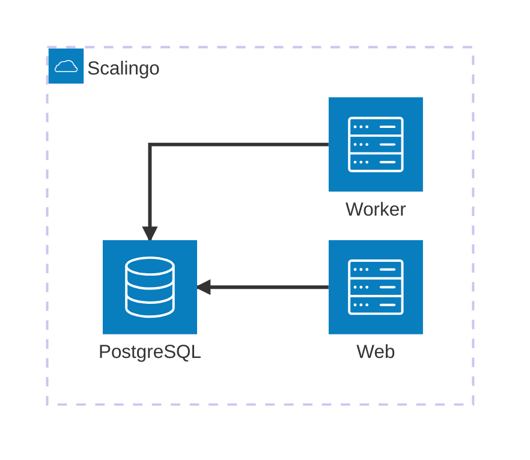
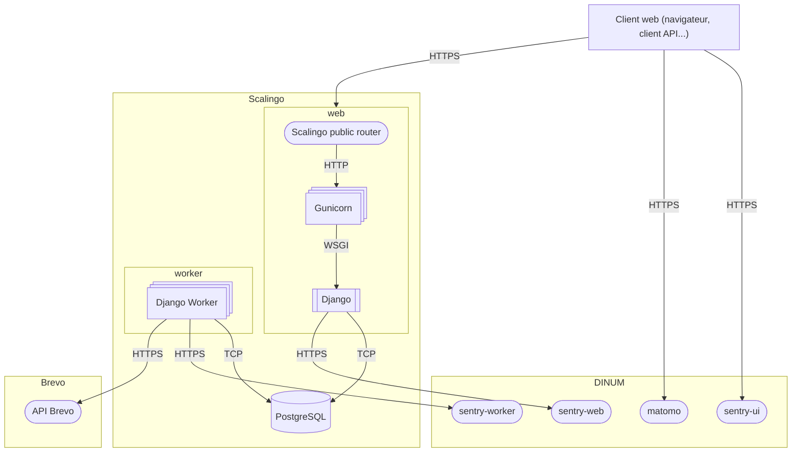

# Aides Agri – Infrastructure et déploiement

## Diagramme d’infrastructure haut niveau

Dans ce diagramme :
* Le service `web` se matérialise par ;
  * Un nombre variable de containers Docker gérés par l’offre PaaS de Scalingo
    * Ce nombre varie entre 2 (pour assurer une redondance permanente) et 10 (maximum possible) ;
    * Ce nombre est géré par le système d’autoscaling de Scalingo ([documentation en anglais](https://doc.scalingo.com/platform/app/scaling/scalingo-autoscaler)) ;
  * Sur chaque container s’exécute la pile technique web décrite ci-dessous ;
* Le service `worker` se matérialise par un unique container Docker ;
* Le service `db` se matérialise par un service managé par Scalingo (qui peut être un nœud unique ou un cluster redondé).

## Services externes

### Envoi d’e-mail : Brevo

* Description : Service d’e-mailing hébergé en France ;
* Utilisation par Aides Agri : envoi d’e-mails transactionnels ;
* Mode d’interaction : API HTTPS.

### Suivi de l’usage du site : instance Matomo de la DINUM

* Description : logiciel open-source de suivi de l’usage d’une application web, hébergé par la DINUM sur https://stats.beta.gouv.fr/ ;
* Utilisation par Aides Agri : suivi de l’usage du site web côté client ;
* Mode d’interaction : API HTTPS.

### Monitoring technique : instance Sentry de la DINUM

* Description : logiciel open-source de télémétrie d’application web, hébergé par la DINUM sur https://sentry.incubateur.net/ ;
* Utilisation par Aides Agri : centralisation des erreurs côté serveur et côté client ;
* Mode d’interaction : API HTTPS.

## Diagramme de flux

Dans ce diagramme :
* La brique "Scalingo Public Router" s’occupe à la fois de la terminaison TLS et du load-balancing vers les différents containers sur lesquels s’exécute Gunicorn (voir [sa documentation (en anglais)](https://doc.scalingo.com/platform/networking/public/overview)) ;
  * Cela signifie que les informations transmises à la brique web circulent, une fois passé ce routeur public, en clair ;
* La brique "worker" consiste en un processus qui tourne en tâche de fond, sans interface utilisateur, et qui collecte des tâches à traiter stockées dans la base de données.

## Réglages possibles impactant les performances de l’application web

Plusieurs paramètres peuvent influer sur les performances (temps de latence, temps de réponse) de l’application web. Ils sont tous réglables sans modification du code de l’application, soit via des variables d’environnement soit via des opérations Scalingo ;

| Brique concernée         | Variable                                                                                                                                                              | Comment l’activer                                                   | Valeur par défaut                                                                                              | Valeur nominale pour Aides Agri                                                                                   |
|--------------------------|-----------------------------------------------------------------------------------------------------------------------------------------------------------------------|---------------------------------------------------------------------|----------------------------------------------------------------------------------------------------------------|-------------------------------------------------------------------------------------------------------------------|
| Scalingo ; containers    | Quelle taille (vCPU/mémoire) ? ([voir la documentation (en anglais)](https://doc.scalingo.com/platform/internals/container-sizes)                                     | Via l’interface ou l’API Scalingo                                   | M                                                                                                              | M                                                                                                                 |                                                                                         |
| Scalingo ; load-balancer | Combien de containers ?                                                                                                                                               | Scaling manuel ou auto-scaling via l’interface ou l’API de Scalingo | 1                                                                                                              | <ul><li>Minimum ; 2</li><li>Métrique ; nombre de requêtes par minute par container</li><li>Valeur ; 200</li></ul> |
| Gunicorn                 | Combien de workers ? ([Voir la documentation Gunicorn (en anglais)](https://gunicorn.org/design/#scaling))                                                            | Variable d’environnement `WEB_CONCURRENCY`                          | [Voir la documentation Scalingo (en anglais)](https://doc.scalingo.com/languages/python/start#web_concurrency) | 3                                                                                                                 |
| Gunicorn                 | Combien de requêtes traitées par chaque worker avant restart ? ([Voir la documentation Gunicorn (en anglais)](https://gunicorn.org/reference/settings/#max_requests)) | Variable d’environnement `GUNICORN_MAX_REQUESTS`                                                                                                               | 0 (les workers ne redémarrent jamais, ce qui peut induire une inflation de la mémoire)                         | 300 ± 10%                                                                                                         |
| Django                   | Combien de temps maintenir les connexions PostgreSQL ouvertes ? ([Voir la documentation Django](https://docs.djangoproject.com/en/5.2/ref/databases/#persistent-database-connections))                                                                    | Variable d’environnement `DB_CONN_MAX_AGE`                                                                                                               | 0 (chaque requête ouvre et ferme sa connexion, ce qui peut induire des latences)                               | 86400s (1 jour)                                                                                                   |

Au vu du nombre de paramètres, l’équilibre peut être délicat à trouver, et il faut surveiller attentivement les différentes métriques affichées dans la console Scalingo ; CPU des containers, mémoire des containers, nombre de connexions ouvertes sur PostgreSQL.

## Procédure de déploiement

Une procédure automatique de déploiement [est configurée via un workflow GitHub](../../.github/workflows/cd.yml) pour déployer la branche `main` à la publication d’une [_release_](https://github.com/betagouv/aides-agri/releases/).

La procédure de déploiement ne fait l’objet d’aucune spécificité, elle utilise le buildpack Scalingo standard pour les applications Python et exécute simplement les processus définis dans [le fichier `Procfile`](../../Procfile).

Scalingo étant un PaaS, le déploiement est fiabilisé via une procédure _blue/green_, c’est-à-dire que les containers de l’ancienne version du code continuent de tourner tant que la procédure de déploiement de la nouvelle version n’est pas terminée et validée.

### Variables d’environnement

| Périmètre    | Variable                                | Usage                                                                                                                                                           | Valeur par défaut                                                                     |
|--------------|-----------------------------------------|-----------------------------------------------------------------------------------------------------------------------------------------------------------------|---------------------------------------------------------------------------------------|
| Scalingo     | `SCALINGO_API_TOKEN`                    | Pour pouvoir utiliser la CLI Scalingo depuis des containers one-off (cf [la doc Scalingo](https://doc.scalingo.com/platform/app/tasks#install-the-scalingo-cli) | Vide                                                                                  |
| Scalingo     | `SCALINGO_APP_ERROR_URL`                | URL de la page statique externe à afficher en cas d’erreur 502 (cf [la doc Scalingo](https://doc.scalingo.com/platform/app/custom-error-page)                   | Vide                                                                                  |
| Scalingo     | `SCALINGO_STOPPED_PAGE_URL`             | URL de la page statique externe à afficher en cas d’arrêt total des serveurs (cf [la doc Scalingo](https://doc.scalingo.com/platform/app/custom-error-page)     | Vide                                                                                  |
| Scalingo     | `SCALINGO_TIMEOUT_ERROR_URL`            | URL de la page statique externe à afficher en cas de timeout applicatif (cf [la doc Scalingo](https://doc.scalingo.com/platform/app/custom-error-page)          | Vide                                                                                  |
| Gunicorn     | `WEB_CONCURRENCY`                       | cf [la doc Gunicorn](https://gunicorn.org/reference/settings/#workers)                                                                                          | cf [la doc Scalingo](https://doc.scalingo.com/languages/python/start#web_concurrency) |
| Gunicorn     | `GUNICORN_MAX_REQUESTS`                 | cf [la doc Gunicorn](https://gunicorn.org/reference/settings/#max_requests)                                                                                     | 0                                                                                     |
| Django       | `DJANGO_SETTINGS_MODULE`                | cf [la doc Django](https://docs.djangoproject.com/en/5.2/topics/settings/#designating-the-settings)                                                             | conf.settings                                                                         |
| Django       | `SECRET_KEY`                            | cf [la doc Django](https://docs.djangoproject.com/en/5.2/ref/settings/#secret-key)                                                                              | Obligatoire                                                                           |
| Django       | `ALLOWED_HOSTS`                         | cf [la doc Django](https://docs.djangoproject.com/en/5.2/ref/settings/#allowed-hosts)                                                                           | Obligatoire                                                                           |
| Django DB    | `DB_HOST`                               | cf [la doc Django](https://docs.djangoproject.com/en/5.2/ref/settings/#databases)                                                                               | Obligatoire                                                                           |
| Django DB    | `DB_PORT`                               | cf [la doc Django](https://docs.djangoproject.com/en/5.2/ref/settings/#databases)                                                                               | Obligatoire                                                                           |
| Django DB    | `DB_USER`                               | cf [la doc Django](https://docs.djangoproject.com/en/5.2/ref/settings/#databases)                                                                               | Obligatoire                                                                           |
| Django DB    | `DB_PASSWORD`                           | cf [la doc Django](https://docs.djangoproject.com/en/5.2/ref/settings/#databases)                                                                               | Obligatoire                                                                           |
| Django DB    | `DB_NAME`                               | cf [la doc Django](https://docs.djangoproject.com/en/5.2/ref/settings/#databases)                                                                               | Obligatoire                                                                           |
| Django DB    | `DB_CONN_MAX_AGE`                       | cf [la doc Django](https://docs.djangoproject.com/en/5.2/ref/settings/#conn-max-age)                                                                            | 0                                                                                     |
| Sentry       | `SENTRY_DSN_WEB`                        | URL de remontée de plantages à Sentry depuis les containers web                                                                                                 | Vide                                                                                  |
| Sentry       | `SENTRY_DSN_WORKER`                     | URL de remontée de plantages à Sentry depuis le container worker                                                                                                | Vide                                                                                  |
| Sentry       | `SENTRY_UI_PROJECT_ID`                  | Identifiant de projet Sentry pour la remontée de plantages Javascript navigateur                                                                                | Vide                                                                                  |
| Sentry       | `SENTRY_UI_PUBLIC_KEY`                  | Clé de connexion à Sentry pour la remontée de plantages Javascript navigateur                                                                                   | Vide                                                                                  |
| Matomo       | `MATOMO_SITE_ID`                        | Identifiant de site pour la remontée de statistiques d’usages sur Matomo                                                                                        | Vide                                                                                  |
| Brevo        | `BREVO_API_KEY`                         | Clé de sécurité pour l’API de Brevo                                                                                                                             | Vide                                                                                  |
| Application  | `ENVIRONMENT`                           | Nom de l’environnement du produit (dev, interne, prod, etc.) il se situe.                                                                                       | Obligatoire                                                                           |
| data.gouv.fr | `DATAGOUV_ENVIRONMENT`                  | Nom de l’environnement data.gouv.fr avec lequel on souhaite interagir (`demo` ou `prod`)                                                                        | `demo`                                                                                |
| data.gouv.fr | `DATAGOUV_API_TOKEN`                    | Jeton d’authentification sur l’API data.gouv.fr                                                                                                                 | Vide                                                                                  |
| aides        | `AIDES_DATAGOUV_ORGANIZATION_ID`        | Identifiant de l’organisation data.gouv.fr vers laquelle on souhaite effectuer des exports                                                                      | Vide                                                                                  |
| aides        | `AIDES_DATAGOUV_DATASET_ID`             | Identifiant du jeu de données data.gouv.fr vers lequel on souhaite effectuer des exports                                                                        | Vide                                                                                  |
| aides        | `AIDES_DATAGOUV_SCHEMA_ID`              | Identifiant du schéma interministériel des aides sur data.gouv.fr                                                                                               | Vide                                                                                  |
| aides        | `AIDES_DATAGOUV_RESOURCE_ID_FOR_SCHEMA` | Identifiant de la ressource data.gouv.fr vers laquelle on souhaite effectuer des exports selon le schéma interministériel des aides                             | Vide                                                                                  |
| aides        | `AIDES_DATAGOUV_RESOURCE_ID_FOR_CUSTOM` | Identifiant de la ressource data.gouv.fr vers laquelle on souhaite effectuer des exports selon un schéma personnalisé                                           | Vide                                                                                  |
